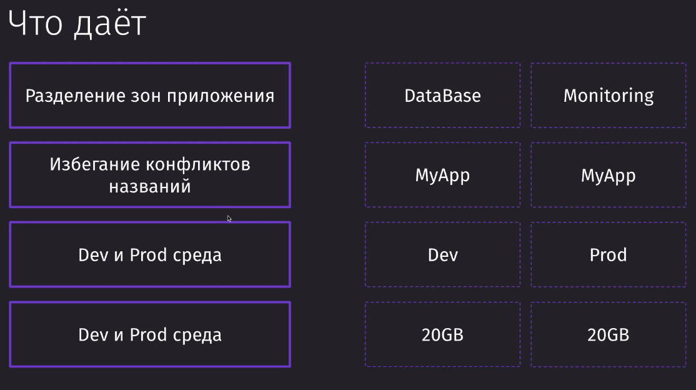

`kubectl get pods`
`kubectl get services`
`kubectl get deploys`

`kubectl delete <deploy | service | pods> $NAME`

`kubectl describe pods $NAME`

`minikube ip` - get ip of minikube
`minikube addons list`
`minikube addons enabled ingress`

`sudo nano /etc/hosts` - better do with .test because with this we won't be redirected to https://

`k port-forward pods/postgres-deployment-85c84f46d6-ckq6r 5432:5432`

`k rollout restart deployment $our_depl`

`kubectl create secret generic $NAME --from-literal PASSWORD=my_pass`
k get secrets
k describe secret

generic | tlc | docker-registry,

`kubectl logs pods/short-api-deployment-56dc979bd9-zxjv6`

`minikube dashboard` - for local dashboard

`kubectl exec -it short-api-deployment-56dc979bd9-zxjv6 -- /bin/bash` - Open container machine in terminal

`k get pods --watch`

`kubectl rollout undo deployment short-api-deployment --to-revision=1`
`k rollout history deployment $NAME`

`k get namespaces`
`k get pods -n my-name-space`
`k apply -f #NAME -n my-name-space`

Namespaces can be shared only with namespaces

